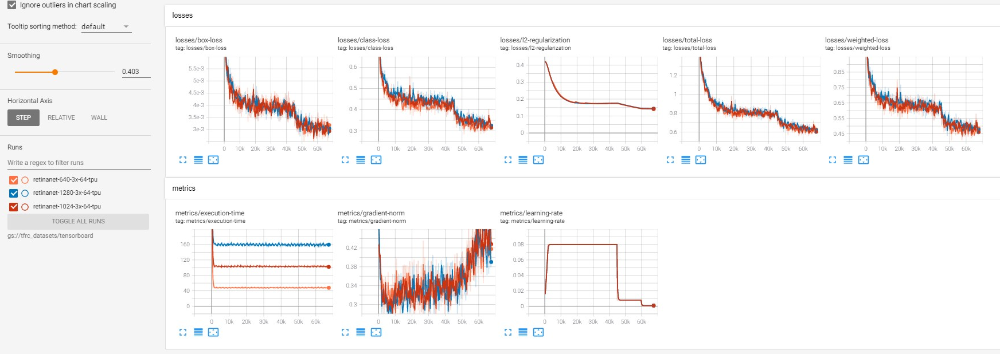

# RetinaNet

### Models
| Backbone | Input Shape | COCO val2017 mAP | Link | Training Time on TPU v3-8 |
| --- | --- | --- | --- |  --- |
| **ResNet50** | 640x640 | 37.1 | [checkpoint](https://github.com/srihari-humbarwadi/retinanet-tensorflow2.x) / [config](configs/retinanet-640-3x-64-tpu.json) | ~3h |
| **ResNet50** | 1024x1024 | 40.0 | [checkpoint](https://github.com/srihari-humbarwadi/retinanet-tensorflow2.x) / [config](configs/retinanet-1026-3x-64-tpu.json) | ~7h |
| **ResNet50** | 1280x1280 | 40.5 | [checkpoint](https://github.com/srihari-humbarwadi/retinanet-tensorflow2.x) / [config](configs/retinanet-1280-3x-64-tpu.json) | ~12h |

 - *All models use imagenet pretrained backhone*
 - *All models adopt the 3x training schedule, where 1x schedule is ~12 epochs. The learning rate schedule is adjusted accordingly*

### Tensorboard



#### To-Do
 - [ ] Add MobileNetV3 Backbone
 - [ ] Train on ResNet18, 34, 101
 - [ ] Add models trained with 30x schedule, without imagenet pretrained weights
 - [ ] Support Input Sharding for TPU Pod
 - [ ] COCO mAP evaluation callback
 - [ ] Add fine-tuning example

```
@misc{1708.02002,
Author = {Tsung-Yi Lin and Priya Goyal and Ross Girshick and Kaiming He and Piotr Dollár},
Title = {Focal Loss for Dense Object Detection},
Year = {2017},
Eprint = {arXiv:1708.02002},
}
```
